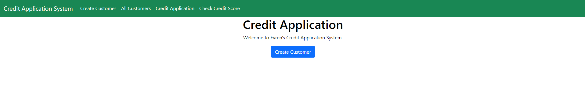
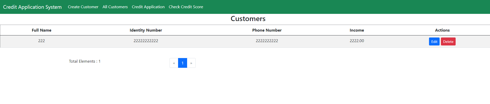
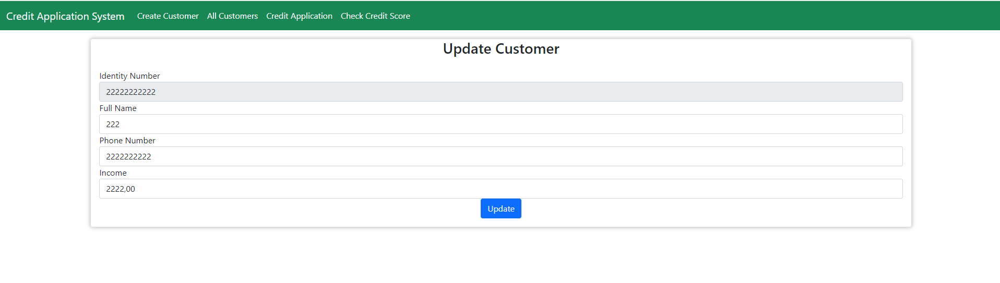
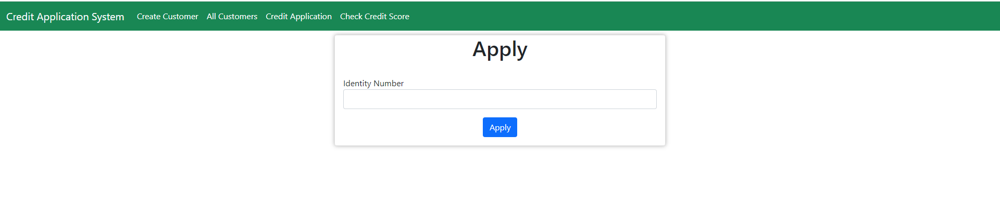
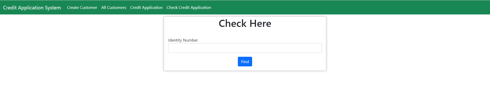

# Getting Started

### Reference Documentation

For further reference, please consider the following sections:

* [Official Apache Maven documentation](https://maven.apache.org/guides/index.html)
* [Spring Boot Maven Plugin Reference Guide](https://docs.spring.io/spring-boot/docs/2.6.3/maven-plugin/reference/html/)
* [Create an OCI image](https://docs.spring.io/spring-boot/docs/2.6.3/maven-plugin/reference/html/#build-image)
* [Validation](https://docs.spring.io/spring-boot/docs/2.6.3/reference/htmlsingle/#boot-features-validation)
* [Spring Web](https://docs.spring.io/spring-boot/docs/2.6.3/reference/htmlsingle/#boot-features-developing-web-applications)
* [Spring Data JPA](https://docs.spring.io/spring-boot/docs/2.6.3/reference/htmlsingle/#boot-features-jpa-and-spring-data)
* [Thymeleaf](https://docs.spring.io/spring-boot/docs/2.6.3/reference/htmlsingle/#boot-features-spring-mvc-template-engines)
* [Spring Boot DevTools](https://docs.spring.io/spring-boot/docs/2.6.3/reference/htmlsingle/#using-boot-devtools)

### Guides

The following guides illustrate how to use some features concretely:

* [Building a RESTful Web Service](https://spring.io/guides/gs/rest-service/)
* [Serving Web Content with Spring MVC](https://spring.io/guides/gs/serving-web-content/)
* [Building REST services with Spring](https://spring.io/guides/tutorials/bookmarks/)
* [Accessing Data with JPA](https://spring.io/guides/gs/accessing-data-jpa/)
* [Handling Form Submission](https://spring.io/guides/gs/handling-form-submission/)

### Built With
* [Java](https://www.oracle.com/java/)
* [IntelliJ Idea](https://www.jetbrains.com/idea/) or [Eclipse](https://www.eclipse.org)
* [Spring Data JPA](https://spring.io/projects/spring-data-jpa)
* [Lombok](https://spring.io/projects/spring-data-jpa)
* [PostgreSQL](https://www.postgresql.org)


### Installation API
1. Clone the repo
   ```sh
   https://github.com/Evren448/innova-patika-graduation-project.git
   ```
2. Docker Build: ``` docker build --tag application-project-innova .```
3. Docker Run: ``` docker run -p8081:8081 application-project-innova```

### Endpoints
| HTTP METHOD | URI                               | Variables                                 | Description               |
|-------------|-----------------------------------|-------------------------------------------|---------------------------|
| GET         | /                                 |                                           | Jump to index page        |
| GET         | /create                           |                                           | Jump to register page     |
| GET         | /check                            |                                           | Jump to check page        |
| GET         | /viewCustomers/{page}             | page : Page number                        | Get all customers         |
| GET         | /creditApplication                | page : Page number                        | Jump to credit_app page   |
| POST        | /customer/create                  |                                           | Create customer           |
| GET         | /customer/update/{id}             | id : Customer id                          | Find updating customer    |
| POST        | /customer/update                  |                                           | Update customer           |
| POST        | /customer/delete/{identityNumber} | identityNumber : Customer Identity Number | Delete customer           |
| POST        | /creditApplication                | identityNumber : Customer Identity Number | Credit Application        |
| GET         | /checkCredit                      | identityNumber : Customer Identity Number | Check Credit Application  |


## User Interfaces
#### Main Page

#### Create Customer

#### All Customer

#### Update Customer

#### Credit Application

#### Check Credit Application


<!-- CONTRIBUTING -->
## Contributing
Any contributions you make are **greatly appreciated**.

If you have a suggestion that would make this better, please fork the repo and create a pull request.

1. Fork the Project
2. Create your Feature Branch (`git checkout -b feature/AmazingFeature`)
3. Commit your Changes (`git commit -m 'Add some AmazingFeature'`)
4. Push to the Branch (`git push origin feature/AmazingFeature`)
5. Open a Pull Request
   <h4 align="center"> OR </h4>
<p align="center"><a href="https://github.com/Evren448/innova-patika-graduation-project/issues">Create an issue</a> </p>

<!-- CONTACT -->
## Contact
Evren Rahimoğlu  - https://www.linkedin.com/in/evrenrahimoglu/

Project Link: https://github.com/Evren448/innova-patika-graduation-project
